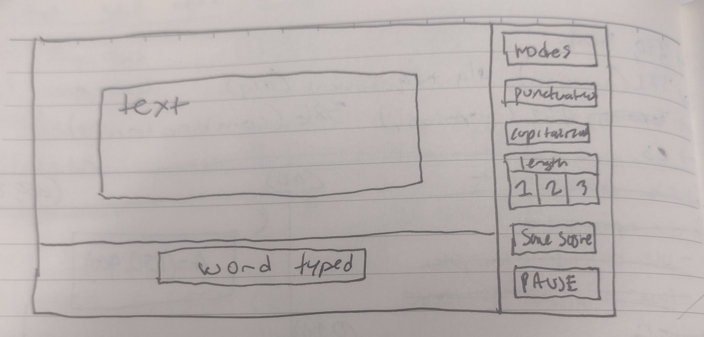
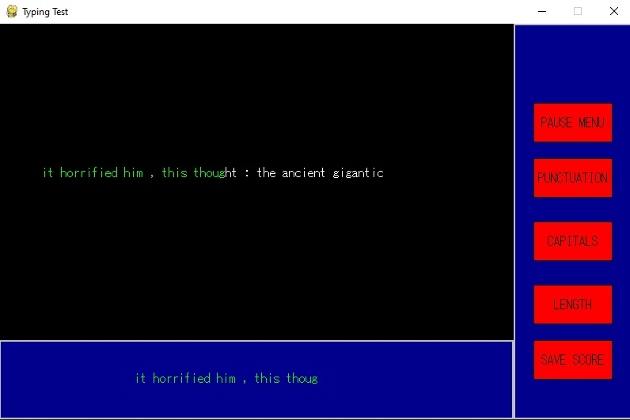

#  Typing Test 
## CS110 Final Project   Semester 2, 2024 

## Team Members

Noah Gell

## Project Description

A typing test. The program has a start menu, pause menu, and the test screen. On the test screen their are buttons that allow you to modify whether the text has punctuation or capitlization. The program is incomplete, the only parts that work are switching between game states, tokenizing sentences for the test from a text file using the nltk, and displaying whether user input matches the sentence. 

The test also has "Stats" screen accesible from the main menu, which was supposed to display a users progress by graphing their wpm and accuracy over time. (this data would be stored and accessed from a text file.) Since the test is unfinished, i just wrote the text file in order to display this part. 

***    

## GUI Design

### Initial Design

### Final Design

## Program Design

### Features
 
1. Menu screen 
2. Test measures wpm
3. Test measures accuracy
4. Abililty to turn of punctuation and casing for the test
5. Ability to make the test shorter or longer
6. Scores recorded, saved, and graphed to show typing speed progress over time.
7. graphic or animation showing how far along you are in the paragraph

### Classes

- buttons: the buttons class creates butons on the screen, and returns when theyve been pressed down. they also change color based on whether the mousing is hovering or theyre clicked. 

- generate_sentences: this class uses the nltk module to tokenize a long text file into sentences, select one at random, and modify it according to modes. 

- startMenu: this class is the start menu game state, it draws a screen with buttons on it, the start button switches the state to "testScreen" and the quit button quits the game. 

- pauseS: this is the pause screen state, draws a screen with buttons, its buttons change to the "testScreen" and "startMenu" state respectively.

- testScreen: this is the main game state. it also draws a screen with buttons. this state is the condition to trigger the eventloop in the controller. 

### Additional modules

- natural language toolkit (https://www.nltk.org/)

## ATP

| Step                 |Procedure             |Expected Results                   |
|----------------------|:--------------------:|----------------------------------:|
|  1                  | 

                                              |GUI window appears with count = 0  |
|  2                   | click count button   | display changes to count = 1      |
etc...
